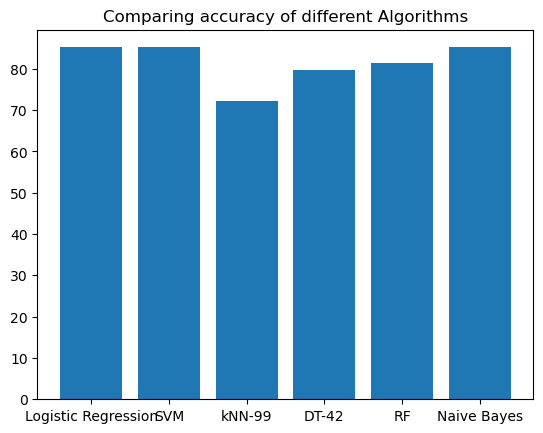

### Heart Disease Prediction

#### About Dataset
<b>Context: </b>The leading cause of death in the developed world is heart disease. Therefore there needs to be work done to help prevent the risks of of having a heart attack or stroke.<br>
<b>Content:</b> Use this dataset to predict which patients are most likely to suffer from a heart disease in the near future using the features given.

### Importing Libraries


```python
import numpy as np
import pandas as pd
import sklearn.datasets
import warnings
warnings.filterwarnings("ignore")
```


```python
df=pd.read_csv(r"C:\Users\giree\OneDrive\Desktop\projects ds\Heart_Disease_Prediction.csv")
```


```python
df
```


<div>
<style scoped>
    .dataframe tbody tr th:only-of-type {
        vertical-align: middle;
    }

    .dataframe tbody tr th {
        vertical-align: top;
    }

    .dataframe thead th {
        text-align: right;
    }
</style>
<table border="1" class="dataframe">
  <thead>
    <tr style="text-align: right;">
      <th></th>
      <th>Age</th>
      <th>Sex</th>
      <th>Chest pain type</th>
      <th>BP</th>
      <th>Cholesterol</th>
      <th>FBS over 120</th>
      <th>EKG results</th>
      <th>Max HR</th>
      <th>Exercise angina</th>
      <th>ST depression</th>
      <th>Slope of ST</th>
      <th>Number of vessels fluro</th>
      <th>Thallium</th>
      <th>Heart Disease</th>
    </tr>
  </thead>
  <tbody>
    <tr>
      <th>0</th>
      <td>70</td>
      <td>1</td>
      <td>4</td>
      <td>130</td>
      <td>322</td>
      <td>0</td>
      <td>2</td>
      <td>109</td>
      <td>0</td>
      <td>2.4</td>
      <td>2</td>
      <td>3</td>
      <td>3</td>
      <td>Presence</td>
    </tr>
    <tr>
      <th>1</th>
      <td>67</td>
      <td>0</td>
      <td>3</td>
      <td>115</td>
      <td>564</td>
      <td>0</td>
      <td>2</td>
      <td>160</td>
      <td>0</td>
      <td>1.6</td>
      <td>2</td>
      <td>0</td>
      <td>7</td>
      <td>Absence</td>
    </tr>
    <tr>
      <th>2</th>
      <td>57</td>
      <td>1</td>
      <td>2</td>
      <td>124</td>
      <td>261</td>
      <td>0</td>
      <td>0</td>
      <td>141</td>
      <td>0</td>
      <td>0.3</td>
      <td>1</td>
      <td>0</td>
      <td>7</td>
      <td>Presence</td>
    </tr>
    <tr>
      <th>3</th>
      <td>64</td>
      <td>1</td>
      <td>4</td>
      <td>128</td>
      <td>263</td>
      <td>0</td>
      <td>0</td>
      <td>105</td>
      <td>1</td>
      <td>0.2</td>
      <td>2</td>
      <td>1</td>
      <td>7</td>
      <td>Absence</td>
    </tr>
    <tr>
      <th>4</th>
      <td>74</td>
      <td>0</td>
      <td>2</td>
      <td>120</td>
      <td>269</td>
      <td>0</td>
      <td>2</td>
      <td>121</td>
      <td>1</td>
      <td>0.2</td>
      <td>1</td>
      <td>1</td>
      <td>3</td>
      <td>Absence</td>
    </tr>
    <tr>
      <th>...</th>
      <td>...</td>
      <td>...</td>
      <td>...</td>
      <td>...</td>
      <td>...</td>
      <td>...</td>
      <td>...</td>
      <td>...</td>
      <td>...</td>
      <td>...</td>
      <td>...</td>
      <td>...</td>
      <td>...</td>
      <td>...</td>
    </tr>
    <tr>
      <th>265</th>
      <td>52</td>
      <td>1</td>
      <td>3</td>
      <td>172</td>
      <td>199</td>
      <td>1</td>
      <td>0</td>
      <td>162</td>
      <td>0</td>
      <td>0.5</td>
      <td>1</td>
      <td>0</td>
      <td>7</td>
      <td>Absence</td>
    </tr>
    <tr>
      <th>266</th>
      <td>44</td>
      <td>1</td>
      <td>2</td>
      <td>120</td>
      <td>263</td>
      <td>0</td>
      <td>0</td>
      <td>173</td>
      <td>0</td>
      <td>0.0</td>
      <td>1</td>
      <td>0</td>
      <td>7</td>
      <td>Absence</td>
    </tr>
    <tr>
      <th>267</th>
      <td>56</td>
      <td>0</td>
      <td>2</td>
      <td>140</td>
      <td>294</td>
      <td>0</td>
      <td>2</td>
      <td>153</td>
      <td>0</td>
      <td>1.3</td>
      <td>2</td>
      <td>0</td>
      <td>3</td>
      <td>Absence</td>
    </tr>
    <tr>
      <th>268</th>
      <td>57</td>
      <td>1</td>
      <td>4</td>
      <td>140</td>
      <td>192</td>
      <td>0</td>
      <td>0</td>
      <td>148</td>
      <td>0</td>
      <td>0.4</td>
      <td>2</td>
      <td>0</td>
      <td>6</td>
      <td>Absence</td>
    </tr>
    <tr>
      <th>269</th>
      <td>67</td>
      <td>1</td>
      <td>4</td>
      <td>160</td>
      <td>286</td>
      <td>0</td>
      <td>2</td>
      <td>108</td>
      <td>1</td>
      <td>1.5</td>
      <td>2</td>
      <td>3</td>
      <td>3</td>
      <td>Presence</td>
    </tr>
  </tbody>
</table>
<p>270 rows × 14 columns</p>
</div>


```python
df['Heart Disease'] = df['Heart Disease'].replace({'Presence': 1, 'Absence': 0})
```


```python
X = df.drop('Heart Disease', axis=1)
Y = df['Heart Disease']
```


```python
X
```


<div>
<style scoped>
    .dataframe tbody tr th:only-of-type {
        vertical-align: middle;
    }

    .dataframe tbody tr th {
        vertical-align: top;
    }

    .dataframe thead th {
        text-align: right;
    }
</style>
<table border="1" class="dataframe">
  <thead>
    <tr style="text-align: right;">
      <th></th>
      <th>Age</th>
      <th>Sex</th>
      <th>Chest pain type</th>
      <th>BP</th>
      <th>Cholesterol</th>
      <th>FBS over 120</th>
      <th>EKG results</th>
      <th>Max HR</th>
      <th>Exercise angina</th>
      <th>ST depression</th>
      <th>Slope of ST</th>
      <th>Number of vessels fluro</th>
      <th>Thallium</th>
    </tr>
  </thead>
  <tbody>
    <tr>
      <th>0</th>
      <td>70</td>
      <td>1</td>
      <td>4</td>
      <td>130</td>
      <td>322</td>
      <td>0</td>
      <td>2</td>
      <td>109</td>
      <td>0</td>
      <td>2.4</td>
      <td>2</td>
      <td>3</td>
      <td>3</td>
    </tr>
    <tr>
      <th>1</th>
      <td>67</td>
      <td>0</td>
      <td>3</td>
      <td>115</td>
      <td>564</td>
      <td>0</td>
      <td>2</td>
      <td>160</td>
      <td>0</td>
      <td>1.6</td>
      <td>2</td>
      <td>0</td>
      <td>7</td>
    </tr>
    <tr>
      <th>2</th>
      <td>57</td>
      <td>1</td>
      <td>2</td>
      <td>124</td>
      <td>261</td>
      <td>0</td>
      <td>0</td>
      <td>141</td>
      <td>0</td>
      <td>0.3</td>
      <td>1</td>
      <td>0</td>
      <td>7</td>
    </tr>
    <tr>
      <th>3</th>
      <td>64</td>
      <td>1</td>
      <td>4</td>
      <td>128</td>
      <td>263</td>
      <td>0</td>
      <td>0</td>
      <td>105</td>
      <td>1</td>
      <td>0.2</td>
      <td>2</td>
      <td>1</td>
      <td>7</td>
    </tr>
    <tr>
      <th>4</th>
      <td>74</td>
      <td>0</td>
      <td>2</td>
      <td>120</td>
      <td>269</td>
      <td>0</td>
      <td>2</td>
      <td>121</td>
      <td>1</td>
      <td>0.2</td>
      <td>1</td>
      <td>1</td>
      <td>3</td>
    </tr>
    <tr>
      <th>...</th>
      <td>...</td>
      <td>...</td>
      <td>...</td>
      <td>...</td>
      <td>...</td>
      <td>...</td>
      <td>...</td>
      <td>...</td>
      <td>...</td>
      <td>...</td>
      <td>...</td>
      <td>...</td>
      <td>...</td>
    </tr>
    <tr>
      <th>265</th>
      <td>52</td>
      <td>1</td>
      <td>3</td>
      <td>172</td>
      <td>199</td>
      <td>1</td>
      <td>0</td>
      <td>162</td>
      <td>0</td>
      <td>0.5</td>
      <td>1</td>
      <td>0</td>
      <td>7</td>
    </tr>
    <tr>
      <th>266</th>
      <td>44</td>
      <td>1</td>
      <td>2</td>
      <td>120</td>
      <td>263</td>
      <td>0</td>
      <td>0</td>
      <td>173</td>
      <td>0</td>
      <td>0.0</td>
      <td>1</td>
      <td>0</td>
      <td>7</td>
    </tr>
    <tr>
      <th>267</th>
      <td>56</td>
      <td>0</td>
      <td>2</td>
      <td>140</td>
      <td>294</td>
      <td>0</td>
      <td>2</td>
      <td>153</td>
      <td>0</td>
      <td>1.3</td>
      <td>2</td>
      <td>0</td>
      <td>3</td>
    </tr>
    <tr>
      <th>268</th>
      <td>57</td>
      <td>1</td>
      <td>4</td>
      <td>140</td>
      <td>192</td>
      <td>0</td>
      <td>0</td>
      <td>148</td>
      <td>0</td>
      <td>0.4</td>
      <td>2</td>
      <td>0</td>
      <td>6</td>
    </tr>
    <tr>
      <th>269</th>
      <td>67</td>
      <td>1</td>
      <td>4</td>
      <td>160</td>
      <td>286</td>
      <td>0</td>
      <td>2</td>
      <td>108</td>
      <td>1</td>
      <td>1.5</td>
      <td>2</td>
      <td>3</td>
      <td>3</td>
    </tr>
  </tbody>
</table>
<p>270 rows × 13 columns</p>
</div>


```python
Y
```


    0      1
    1      0
    2      1
    3      0
    4      0
          ..
    265    0
    266    0
    267    0
    268    0
    269    1
    Name: Heart Disease, Length: 270, dtype: int64


```python
print(X.shape, Y.shape)
```

    (270, 13) (270,)
    


```python
df.groupby('Heart Disease').mean()
```


<div>
<style scoped>
    .dataframe tbody tr th:only-of-type {
        vertical-align: middle;
    }

    .dataframe tbody tr th {
        vertical-align: top;
    }

    .dataframe thead th {
        text-align: right;
    }
</style>
<table border="1" class="dataframe">
  <thead>
    <tr style="text-align: right;">
      <th></th>
      <th>Age</th>
      <th>Sex</th>
      <th>Chest pain type</th>
      <th>BP</th>
      <th>Cholesterol</th>
      <th>FBS over 120</th>
      <th>EKG results</th>
      <th>Max HR</th>
      <th>Exercise angina</th>
      <th>ST depression</th>
      <th>Slope of ST</th>
      <th>Number of vessels fluro</th>
      <th>Thallium</th>
    </tr>
    <tr>
      <th>Heart Disease</th>
      <th></th>
      <th></th>
      <th></th>
      <th></th>
      <th></th>
      <th></th>
      <th></th>
      <th></th>
      <th></th>
      <th></th>
      <th></th>
      <th></th>
      <th></th>
    </tr>
  </thead>
  <tbody>
    <tr>
      <th>0</th>
      <td>52.706667</td>
      <td>0.553333</td>
      <td>2.820000</td>
      <td>128.866667</td>
      <td>244.213333</td>
      <td>0.153333</td>
      <td>0.860</td>
      <td>158.333333</td>
      <td>0.153333</td>
      <td>0.622667</td>
      <td>1.400000</td>
      <td>0.286667</td>
      <td>3.786667</td>
    </tr>
    <tr>
      <th>1</th>
      <td>56.591667</td>
      <td>0.833333</td>
      <td>3.616667</td>
      <td>134.441667</td>
      <td>256.466667</td>
      <td>0.141667</td>
      <td>1.225</td>
      <td>138.858333</td>
      <td>0.550000</td>
      <td>1.584167</td>
      <td>1.816667</td>
      <td>1.150000</td>
      <td>5.833333</td>
    </tr>
  </tbody>
</table>
</div>


### Model prediction and evaluation 


```python
from sklearn.model_selection import train_test_split
X_train, X_test, Y_train, Y_test = train_test_split(X, Y, test_size=0.2, stratify=Y, random_state=42)
```


```python
print(Y.shape, Y_train.shape, Y_test.shape)
```

    (270,) (216,) (54,)
    


```python
print(X_train.mean(), X_test.mean(), X.mean())
```

    Age                         54.361111
    Sex                          0.685185
    Chest pain type              3.101852
    BP                         131.074074
    Cholesterol                248.287037
    FBS over 120                 0.134259
    EKG results                  1.050926
    Max HR                     150.555556
    Exercise angina              0.319444
    ST depression                1.044907
    Slope of ST                  1.578704
    Number of vessels fluro      0.662037
    Thallium                     4.652778
    dtype: float64 Age                         54.722222
    Sex                          0.648148
    Chest pain type              3.462963
    BP                         132.425926
    Cholesterol                255.148148
    FBS over 120                 0.203704
    EKG results                  0.907407
    Max HR                     146.166667
    Exercise angina              0.370370
    ST depression                1.070370
    Slope of ST                  1.611111
    Number of vessels fluro      0.703704
    Thallium                     4.870370
    dtype: float64 Age                         54.433333
    Sex                          0.677778
    Chest pain type              3.174074
    BP                         131.344444
    Cholesterol                249.659259
    FBS over 120                 0.148148
    EKG results                  1.022222
    Max HR                     149.677778
    Exercise angina              0.329630
    ST depression                1.050000
    Slope of ST                  1.585185
    Number of vessels fluro      0.670370
    Thallium                     4.696296
    dtype: float64
    

### logistic regression


```python
from sklearn.linear_model import LogisticRegression
```


```python
classifier = LogisticRegression()
#training the model on training data
classifier.fit(X_train, Y_train)
```


<style>#sk-container-id-5 {color: black;}#sk-container-id-5 pre{padding: 0;}#sk-container-id-5 div.sk-toggleable {background-color: white;}#sk-container-id-5 label.sk-toggleable__label {cursor: pointer;display: block;width: 100%;margin-bottom: 0;padding: 0.3em;box-sizing: border-box;text-align: center;}#sk-container-id-5 label.sk-toggleable__label-arrow:before {content: "▸";float: left;margin-right: 0.25em;color: #696969;}#sk-container-id-5 label.sk-toggleable__label-arrow:hover:before {color: black;}#sk-container-id-5 div.sk-estimator:hover label.sk-toggleable__label-arrow:before {color: black;}#sk-container-id-5 div.sk-toggleable__content {max-height: 0;max-width: 0;overflow: hidden;text-align: left;background-color: #f0f8ff;}#sk-container-id-5 div.sk-toggleable__content pre {margin: 0.2em;color: black;border-radius: 0.25em;background-color: #f0f8ff;}#sk-container-id-5 input.sk-toggleable__control:checked~div.sk-toggleable__content {max-height: 200px;max-width: 100%;overflow: auto;}#sk-container-id-5 input.sk-toggleable__control:checked~label.sk-toggleable__label-arrow:before {content: "▾";}#sk-container-id-5 div.sk-estimator input.sk-toggleable__control:checked~label.sk-toggleable__label {background-color: #d4ebff;}#sk-container-id-5 div.sk-label input.sk-toggleable__control:checked~label.sk-toggleable__label {background-color: #d4ebff;}#sk-container-id-5 input.sk-hidden--visually {border: 0;clip: rect(1px 1px 1px 1px);clip: rect(1px, 1px, 1px, 1px);height: 1px;margin: -1px;overflow: hidden;padding: 0;position: absolute;width: 1px;}#sk-container-id-5 div.sk-estimator {font-family: monospace;background-color: #f0f8ff;border: 1px dotted black;border-radius: 0.25em;box-sizing: border-box;margin-bottom: 0.5em;}#sk-container-id-5 div.sk-estimator:hover {background-color: #d4ebff;}#sk-container-id-5 div.sk-parallel-item::after {content: "";width: 100%;border-bottom: 1px solid gray;flex-grow: 1;}#sk-container-id-5 div.sk-label:hover label.sk-toggleable__label {background-color: #d4ebff;}#sk-container-id-5 div.sk-serial::before {content: "";position: absolute;border-left: 1px solid gray;box-sizing: border-box;top: 0;bottom: 0;left: 50%;z-index: 0;}#sk-container-id-5 div.sk-serial {display: flex;flex-direction: column;align-items: center;background-color: white;padding-right: 0.2em;padding-left: 0.2em;position: relative;}#sk-container-id-5 div.sk-item {position: relative;z-index: 1;}#sk-container-id-5 div.sk-parallel {display: flex;align-items: stretch;justify-content: center;background-color: white;position: relative;}#sk-container-id-5 div.sk-item::before, #sk-container-id-5 div.sk-parallel-item::before {content: "";position: absolute;border-left: 1px solid gray;box-sizing: border-box;top: 0;bottom: 0;left: 50%;z-index: -1;}#sk-container-id-5 div.sk-parallel-item {display: flex;flex-direction: column;z-index: 1;position: relative;background-color: white;}#sk-container-id-5 div.sk-parallel-item:first-child::after {align-self: flex-end;width: 50%;}#sk-container-id-5 div.sk-parallel-item:last-child::after {align-self: flex-start;width: 50%;}#sk-container-id-5 div.sk-parallel-item:only-child::after {width: 0;}#sk-container-id-5 div.sk-dashed-wrapped {border: 1px dashed gray;margin: 0 0.4em 0.5em 0.4em;box-sizing: border-box;padding-bottom: 0.4em;background-color: white;}#sk-container-id-5 div.sk-label label {font-family: monospace;font-weight: bold;display: inline-block;line-height: 1.2em;}#sk-container-id-5 div.sk-label-container {text-align: center;}#sk-container-id-5 div.sk-container {/* jupyter's `normalize.less` sets `[hidden] { display: none; }` but bootstrap.min.css set `[hidden] { display: none !important; }` so we also need the `!important` here to be able to override the default hidden behavior on the sphinx rendered scikit-learn.org. See: https://github.com/scikit-learn/scikit-learn/issues/21755 */display: inline-block !important;position: relative;}#sk-container-id-5 div.sk-text-repr-fallback {display: none;}</style><div id="sk-container-id-5" class="sk-top-container"><div class="sk-text-repr-fallback"><pre>LogisticRegression()</pre><b>In a Jupyter environment, please rerun this cell to show the HTML representation or trust the notebook. <br />On GitHub, the HTML representation is unable to render, please try loading this page with nbviewer.org.</b></div><div class="sk-container" hidden><div class="sk-item"><div class="sk-estimator sk-toggleable"><input class="sk-toggleable__control sk-hidden--visually" id="sk-estimator-id-5" type="checkbox" checked><label for="sk-estimator-id-5" class="sk-toggleable__label sk-toggleable__label-arrow">LogisticRegression</label><div class="sk-toggleable__content"><pre>LogisticRegression()</pre></div></div></div></div></div>


```python
from sklearn.metrics import accuracy_score, confusion_matrix, classification_report
```


```python
prediction = classifier.predict(X_test)
accuracy = accuracy_score(Y_test, prediction)
```


```python
accuracy_dict = {}
accuracy_dict['Logistic Regression'] = round((accuracy * 100),2)
```


```python
print(f'Accuracy: {accuracy}')
```

    Accuracy: 0.8518518518518519
    


```python
accuracy_dict
```


    {'Logistic Regression': 85.19}


```python
# Confusion Matrix
conf_matrix = confusion_matrix(Y_test, prediction)
print(f'Confusion Matrix:\n{conf_matrix}')
```

    Confusion Matrix:
    [[25  5]
     [ 3 21]]
    


```python
 #Classification Report
class_report = classification_report(Y_test, prediction)
print(f'Classification Report:\n{class_report}')
```

    Classification Report:
                  precision    recall  f1-score   support
    
               0       0.89      0.83      0.86        30
               1       0.81      0.88      0.84        24
    
        accuracy                           0.85        54
       macro avg       0.85      0.85      0.85        54
    weighted avg       0.86      0.85      0.85        54
    
    

### SVM


```python
from sklearn.svm import SVC
# Initialize the model
model = SVC(kernel='linear')
# Train the model
model.fit(X_train, Y_train)
# Predictions
prediction = model.predict(X_test)
# Accuracy
accuracy = accuracy_score(Y_test, prediction)
print(f'Accuracy: {accuracy}')
```

    Accuracy: 0.8518518518518519
    


```python
accuracy_dict['SVM'] = round(accuracy * 100, 2)
# Confusion Matrix
conf_matrix = confusion_matrix(Y_test, prediction)
print(f'Confusion Matrix:\n{conf_matrix}')
```

    Confusion Matrix:
    [[25  5]
     [ 3 21]]
    


```python
# Classification Report
class_report = classification_report(Y_test, prediction)
print(f'Classification Report:\n{class_report}')
```

    Classification Report:
                  precision    recall  f1-score   support
    
               0       0.89      0.83      0.86        30
               1       0.81      0.88      0.84        24
    
        accuracy                           0.85        54
       macro avg       0.85      0.85      0.85        54
    weighted avg       0.86      0.85      0.85        54
    
    

### k-Nearest Neighbors


```python
from sklearn.neighbors import KNeighborsClassifier
# Initialize the model
k = 99  # Choosing k=99 for this example
model = KNeighborsClassifier(n_neighbors=k)
# Train the model
model.fit(X_train, Y_train)
```


<style>#sk-container-id-6 {color: black;}#sk-container-id-6 pre{padding: 0;}#sk-container-id-6 div.sk-toggleable {background-color: white;}#sk-container-id-6 label.sk-toggleable__label {cursor: pointer;display: block;width: 100%;margin-bottom: 0;padding: 0.3em;box-sizing: border-box;text-align: center;}#sk-container-id-6 label.sk-toggleable__label-arrow:before {content: "▸";float: left;margin-right: 0.25em;color: #696969;}#sk-container-id-6 label.sk-toggleable__label-arrow:hover:before {color: black;}#sk-container-id-6 div.sk-estimator:hover label.sk-toggleable__label-arrow:before {color: black;}#sk-container-id-6 div.sk-toggleable__content {max-height: 0;max-width: 0;overflow: hidden;text-align: left;background-color: #f0f8ff;}#sk-container-id-6 div.sk-toggleable__content pre {margin: 0.2em;color: black;border-radius: 0.25em;background-color: #f0f8ff;}#sk-container-id-6 input.sk-toggleable__control:checked~div.sk-toggleable__content {max-height: 200px;max-width: 100%;overflow: auto;}#sk-container-id-6 input.sk-toggleable__control:checked~label.sk-toggleable__label-arrow:before {content: "▾";}#sk-container-id-6 div.sk-estimator input.sk-toggleable__control:checked~label.sk-toggleable__label {background-color: #d4ebff;}#sk-container-id-6 div.sk-label input.sk-toggleable__control:checked~label.sk-toggleable__label {background-color: #d4ebff;}#sk-container-id-6 input.sk-hidden--visually {border: 0;clip: rect(1px 1px 1px 1px);clip: rect(1px, 1px, 1px, 1px);height: 1px;margin: -1px;overflow: hidden;padding: 0;position: absolute;width: 1px;}#sk-container-id-6 div.sk-estimator {font-family: monospace;background-color: #f0f8ff;border: 1px dotted black;border-radius: 0.25em;box-sizing: border-box;margin-bottom: 0.5em;}#sk-container-id-6 div.sk-estimator:hover {background-color: #d4ebff;}#sk-container-id-6 div.sk-parallel-item::after {content: "";width: 100%;border-bottom: 1px solid gray;flex-grow: 1;}#sk-container-id-6 div.sk-label:hover label.sk-toggleable__label {background-color: #d4ebff;}#sk-container-id-6 div.sk-serial::before {content: "";position: absolute;border-left: 1px solid gray;box-sizing: border-box;top: 0;bottom: 0;left: 50%;z-index: 0;}#sk-container-id-6 div.sk-serial {display: flex;flex-direction: column;align-items: center;background-color: white;padding-right: 0.2em;padding-left: 0.2em;position: relative;}#sk-container-id-6 div.sk-item {position: relative;z-index: 1;}#sk-container-id-6 div.sk-parallel {display: flex;align-items: stretch;justify-content: center;background-color: white;position: relative;}#sk-container-id-6 div.sk-item::before, #sk-container-id-6 div.sk-parallel-item::before {content: "";position: absolute;border-left: 1px solid gray;box-sizing: border-box;top: 0;bottom: 0;left: 50%;z-index: -1;}#sk-container-id-6 div.sk-parallel-item {display: flex;flex-direction: column;z-index: 1;position: relative;background-color: white;}#sk-container-id-6 div.sk-parallel-item:first-child::after {align-self: flex-end;width: 50%;}#sk-container-id-6 div.sk-parallel-item:last-child::after {align-self: flex-start;width: 50%;}#sk-container-id-6 div.sk-parallel-item:only-child::after {width: 0;}#sk-container-id-6 div.sk-dashed-wrapped {border: 1px dashed gray;margin: 0 0.4em 0.5em 0.4em;box-sizing: border-box;padding-bottom: 0.4em;background-color: white;}#sk-container-id-6 div.sk-label label {font-family: monospace;font-weight: bold;display: inline-block;line-height: 1.2em;}#sk-container-id-6 div.sk-label-container {text-align: center;}#sk-container-id-6 div.sk-container {/* jupyter's `normalize.less` sets `[hidden] { display: none; }` but bootstrap.min.css set `[hidden] { display: none !important; }` so we also need the `!important` here to be able to override the default hidden behavior on the sphinx rendered scikit-learn.org. See: https://github.com/scikit-learn/scikit-learn/issues/21755 */display: inline-block !important;position: relative;}#sk-container-id-6 div.sk-text-repr-fallback {display: none;}</style><div id="sk-container-id-6" class="sk-top-container"><div class="sk-text-repr-fallback"><pre>KNeighborsClassifier(n_neighbors=99)</pre><b>In a Jupyter environment, please rerun this cell to show the HTML representation or trust the notebook. <br />On GitHub, the HTML representation is unable to render, please try loading this page with nbviewer.org.</b></div><div class="sk-container" hidden><div class="sk-item"><div class="sk-estimator sk-toggleable"><input class="sk-toggleable__control sk-hidden--visually" id="sk-estimator-id-6" type="checkbox" checked><label for="sk-estimator-id-6" class="sk-toggleable__label sk-toggleable__label-arrow">KNeighborsClassifier</label><div class="sk-toggleable__content"><pre>KNeighborsClassifier(n_neighbors=99)</pre></div></div></div></div></div>


```python
# Predictions
prediction = model.predict(X_test)
# Accuracy
accuracy = accuracy_score(Y_test, prediction)
print(f'Accuracy: {accuracy}')
```

    Accuracy: 0.7222222222222222
    


```python
accuracy_dict['kNN-99'] = round(accuracy * 100, 2)
# Confusion Matrix
conf_matrix = confusion_matrix(Y_test, prediction)
print(f'Confusion Matrix:\n{conf_matrix}')
```

    Confusion Matrix:
    [[25  5]
     [10 14]]
    


```python
# Classification Report
class_report = classification_report(Y_test, prediction)
print(f'Classification Report:\n{class_report}')
```

    Classification Report:
                  precision    recall  f1-score   support
    
               0       0.71      0.83      0.77        30
               1       0.74      0.58      0.65        24
    
        accuracy                           0.72        54
       macro avg       0.73      0.71      0.71        54
    weighted avg       0.72      0.72      0.72        54
    
    

### Decision Tree


```python
from sklearn.tree import DecisionTreeClassifier
# Initialize the model
model = DecisionTreeClassifier(random_state=42)
# Train the model
model.fit(X_train, Y_train)
```


<style>#sk-container-id-7 {color: black;}#sk-container-id-7 pre{padding: 0;}#sk-container-id-7 div.sk-toggleable {background-color: white;}#sk-container-id-7 label.sk-toggleable__label {cursor: pointer;display: block;width: 100%;margin-bottom: 0;padding: 0.3em;box-sizing: border-box;text-align: center;}#sk-container-id-7 label.sk-toggleable__label-arrow:before {content: "▸";float: left;margin-right: 0.25em;color: #696969;}#sk-container-id-7 label.sk-toggleable__label-arrow:hover:before {color: black;}#sk-container-id-7 div.sk-estimator:hover label.sk-toggleable__label-arrow:before {color: black;}#sk-container-id-7 div.sk-toggleable__content {max-height: 0;max-width: 0;overflow: hidden;text-align: left;background-color: #f0f8ff;}#sk-container-id-7 div.sk-toggleable__content pre {margin: 0.2em;color: black;border-radius: 0.25em;background-color: #f0f8ff;}#sk-container-id-7 input.sk-toggleable__control:checked~div.sk-toggleable__content {max-height: 200px;max-width: 100%;overflow: auto;}#sk-container-id-7 input.sk-toggleable__control:checked~label.sk-toggleable__label-arrow:before {content: "▾";}#sk-container-id-7 div.sk-estimator input.sk-toggleable__control:checked~label.sk-toggleable__label {background-color: #d4ebff;}#sk-container-id-7 div.sk-label input.sk-toggleable__control:checked~label.sk-toggleable__label {background-color: #d4ebff;}#sk-container-id-7 input.sk-hidden--visually {border: 0;clip: rect(1px 1px 1px 1px);clip: rect(1px, 1px, 1px, 1px);height: 1px;margin: -1px;overflow: hidden;padding: 0;position: absolute;width: 1px;}#sk-container-id-7 div.sk-estimator {font-family: monospace;background-color: #f0f8ff;border: 1px dotted black;border-radius: 0.25em;box-sizing: border-box;margin-bottom: 0.5em;}#sk-container-id-7 div.sk-estimator:hover {background-color: #d4ebff;}#sk-container-id-7 div.sk-parallel-item::after {content: "";width: 100%;border-bottom: 1px solid gray;flex-grow: 1;}#sk-container-id-7 div.sk-label:hover label.sk-toggleable__label {background-color: #d4ebff;}#sk-container-id-7 div.sk-serial::before {content: "";position: absolute;border-left: 1px solid gray;box-sizing: border-box;top: 0;bottom: 0;left: 50%;z-index: 0;}#sk-container-id-7 div.sk-serial {display: flex;flex-direction: column;align-items: center;background-color: white;padding-right: 0.2em;padding-left: 0.2em;position: relative;}#sk-container-id-7 div.sk-item {position: relative;z-index: 1;}#sk-container-id-7 div.sk-parallel {display: flex;align-items: stretch;justify-content: center;background-color: white;position: relative;}#sk-container-id-7 div.sk-item::before, #sk-container-id-7 div.sk-parallel-item::before {content: "";position: absolute;border-left: 1px solid gray;box-sizing: border-box;top: 0;bottom: 0;left: 50%;z-index: -1;}#sk-container-id-7 div.sk-parallel-item {display: flex;flex-direction: column;z-index: 1;position: relative;background-color: white;}#sk-container-id-7 div.sk-parallel-item:first-child::after {align-self: flex-end;width: 50%;}#sk-container-id-7 div.sk-parallel-item:last-child::after {align-self: flex-start;width: 50%;}#sk-container-id-7 div.sk-parallel-item:only-child::after {width: 0;}#sk-container-id-7 div.sk-dashed-wrapped {border: 1px dashed gray;margin: 0 0.4em 0.5em 0.4em;box-sizing: border-box;padding-bottom: 0.4em;background-color: white;}#sk-container-id-7 div.sk-label label {font-family: monospace;font-weight: bold;display: inline-block;line-height: 1.2em;}#sk-container-id-7 div.sk-label-container {text-align: center;}#sk-container-id-7 div.sk-container {/* jupyter's `normalize.less` sets `[hidden] { display: none; }` but bootstrap.min.css set `[hidden] { display: none !important; }` so we also need the `!important` here to be able to override the default hidden behavior on the sphinx rendered scikit-learn.org. See: https://github.com/scikit-learn/scikit-learn/issues/21755 */display: inline-block !important;position: relative;}#sk-container-id-7 div.sk-text-repr-fallback {display: none;}</style><div id="sk-container-id-7" class="sk-top-container"><div class="sk-text-repr-fallback"><pre>DecisionTreeClassifier(random_state=42)</pre><b>In a Jupyter environment, please rerun this cell to show the HTML representation or trust the notebook. <br />On GitHub, the HTML representation is unable to render, please try loading this page with nbviewer.org.</b></div><div class="sk-container" hidden><div class="sk-item"><div class="sk-estimator sk-toggleable"><input class="sk-toggleable__control sk-hidden--visually" id="sk-estimator-id-7" type="checkbox" checked><label for="sk-estimator-id-7" class="sk-toggleable__label sk-toggleable__label-arrow">DecisionTreeClassifier</label><div class="sk-toggleable__content"><pre>DecisionTreeClassifier(random_state=42)</pre></div></div></div></div></div>


```python
prediction = model.predict(X_test)
# Accuracy
accuracy = accuracy_score(Y_test, prediction)
print(f'Accuracy: {accuracy}')
```

    Accuracy: 0.7962962962962963
    


```python
accuracy_dict['DT-42'] = round(accuracy * 100, 2)
# Confusion Matrix
conf_matrix = confusion_matrix(Y_test, prediction)
print(f'Confusion Matrix:\n{conf_matrix}')
```

    Confusion Matrix:
    [[23  7]
     [ 4 20]]
    


```python
# Classification Report
class_report = classification_report(Y_test, prediction)
print(f'Classification Report:\n{class_report}')
```

    Classification Report:
                  precision    recall  f1-score   support
    
               0       0.85      0.77      0.81        30
               1       0.74      0.83      0.78        24
    
        accuracy                           0.80        54
       macro avg       0.80      0.80      0.80        54
    weighted avg       0.80      0.80      0.80        54
    
    

### Random Forest


```python
from sklearn.ensemble import RandomForestClassifier
# Initialize the model
model = RandomForestClassifier(random_state=42)
# Train the model
model.fit(X_train, Y_train)
```


<style>#sk-container-id-8 {color: black;}#sk-container-id-8 pre{padding: 0;}#sk-container-id-8 div.sk-toggleable {background-color: white;}#sk-container-id-8 label.sk-toggleable__label {cursor: pointer;display: block;width: 100%;margin-bottom: 0;padding: 0.3em;box-sizing: border-box;text-align: center;}#sk-container-id-8 label.sk-toggleable__label-arrow:before {content: "▸";float: left;margin-right: 0.25em;color: #696969;}#sk-container-id-8 label.sk-toggleable__label-arrow:hover:before {color: black;}#sk-container-id-8 div.sk-estimator:hover label.sk-toggleable__label-arrow:before {color: black;}#sk-container-id-8 div.sk-toggleable__content {max-height: 0;max-width: 0;overflow: hidden;text-align: left;background-color: #f0f8ff;}#sk-container-id-8 div.sk-toggleable__content pre {margin: 0.2em;color: black;border-radius: 0.25em;background-color: #f0f8ff;}#sk-container-id-8 input.sk-toggleable__control:checked~div.sk-toggleable__content {max-height: 200px;max-width: 100%;overflow: auto;}#sk-container-id-8 input.sk-toggleable__control:checked~label.sk-toggleable__label-arrow:before {content: "▾";}#sk-container-id-8 div.sk-estimator input.sk-toggleable__control:checked~label.sk-toggleable__label {background-color: #d4ebff;}#sk-container-id-8 div.sk-label input.sk-toggleable__control:checked~label.sk-toggleable__label {background-color: #d4ebff;}#sk-container-id-8 input.sk-hidden--visually {border: 0;clip: rect(1px 1px 1px 1px);clip: rect(1px, 1px, 1px, 1px);height: 1px;margin: -1px;overflow: hidden;padding: 0;position: absolute;width: 1px;}#sk-container-id-8 div.sk-estimator {font-family: monospace;background-color: #f0f8ff;border: 1px dotted black;border-radius: 0.25em;box-sizing: border-box;margin-bottom: 0.5em;}#sk-container-id-8 div.sk-estimator:hover {background-color: #d4ebff;}#sk-container-id-8 div.sk-parallel-item::after {content: "";width: 100%;border-bottom: 1px solid gray;flex-grow: 1;}#sk-container-id-8 div.sk-label:hover label.sk-toggleable__label {background-color: #d4ebff;}#sk-container-id-8 div.sk-serial::before {content: "";position: absolute;border-left: 1px solid gray;box-sizing: border-box;top: 0;bottom: 0;left: 50%;z-index: 0;}#sk-container-id-8 div.sk-serial {display: flex;flex-direction: column;align-items: center;background-color: white;padding-right: 0.2em;padding-left: 0.2em;position: relative;}#sk-container-id-8 div.sk-item {position: relative;z-index: 1;}#sk-container-id-8 div.sk-parallel {display: flex;align-items: stretch;justify-content: center;background-color: white;position: relative;}#sk-container-id-8 div.sk-item::before, #sk-container-id-8 div.sk-parallel-item::before {content: "";position: absolute;border-left: 1px solid gray;box-sizing: border-box;top: 0;bottom: 0;left: 50%;z-index: -1;}#sk-container-id-8 div.sk-parallel-item {display: flex;flex-direction: column;z-index: 1;position: relative;background-color: white;}#sk-container-id-8 div.sk-parallel-item:first-child::after {align-self: flex-end;width: 50%;}#sk-container-id-8 div.sk-parallel-item:last-child::after {align-self: flex-start;width: 50%;}#sk-container-id-8 div.sk-parallel-item:only-child::after {width: 0;}#sk-container-id-8 div.sk-dashed-wrapped {border: 1px dashed gray;margin: 0 0.4em 0.5em 0.4em;box-sizing: border-box;padding-bottom: 0.4em;background-color: white;}#sk-container-id-8 div.sk-label label {font-family: monospace;font-weight: bold;display: inline-block;line-height: 1.2em;}#sk-container-id-8 div.sk-label-container {text-align: center;}#sk-container-id-8 div.sk-container {/* jupyter's `normalize.less` sets `[hidden] { display: none; }` but bootstrap.min.css set `[hidden] { display: none !important; }` so we also need the `!important` here to be able to override the default hidden behavior on the sphinx rendered scikit-learn.org. See: https://github.com/scikit-learn/scikit-learn/issues/21755 */display: inline-block !important;position: relative;}#sk-container-id-8 div.sk-text-repr-fallback {display: none;}</style><div id="sk-container-id-8" class="sk-top-container"><div class="sk-text-repr-fallback"><pre>RandomForestClassifier(random_state=42)</pre><b>In a Jupyter environment, please rerun this cell to show the HTML representation or trust the notebook. <br />On GitHub, the HTML representation is unable to render, please try loading this page with nbviewer.org.</b></div><div class="sk-container" hidden><div class="sk-item"><div class="sk-estimator sk-toggleable"><input class="sk-toggleable__control sk-hidden--visually" id="sk-estimator-id-8" type="checkbox" checked><label for="sk-estimator-id-8" class="sk-toggleable__label sk-toggleable__label-arrow">RandomForestClassifier</label><div class="sk-toggleable__content"><pre>RandomForestClassifier(random_state=42)</pre></div></div></div></div></div>


```python
# Predictions
prediction = model.predict(X_test)
# Accuracy
accuracy = accuracy_score(Y_test, prediction)
print(f'Accuracy: {accuracy}')
```

    Accuracy: 0.8148148148148148
    


```python
accuracy_dict['RF'] = round(accuracy * 100, 2)
# Confusion Matrix
conf_matrix = confusion_matrix(Y_test, prediction)
print(f'Confusion Matrix:\n{conf_matrix}')
```

    Confusion Matrix:
    [[24  6]
     [ 4 20]]
    


```python
# Classification Report
class_report = classification_report(Y_test, prediction)
print(f'Classification Report:\n{class_report}')
```

    Classification Report:
                  precision    recall  f1-score   support
    
               0       0.86      0.80      0.83        30
               1       0.77      0.83      0.80        24
    
        accuracy                           0.81        54
       macro avg       0.81      0.82      0.81        54
    weighted avg       0.82      0.81      0.82        54
    
    


```python
from sklearn.preprocessing import StandardScaler
from sklearn.naive_bayes import GaussianNB

# Initialize the model
model = GaussianNB()

# Train the model
model.fit(X_train, Y_train)

# Predictions
y_pred = model.predict(X_test)

# Accuracy
accuracy = accuracy_score(Y_test, y_pred)
print(f'Accuracy: {accuracy}')

accuracy_dict['Naive Bayes'] = round(accuracy * 100, 2)

# Confusion Matrix
conf_matrix = confusion_matrix(Y_test, y_pred)
print(f'Confusion Matrix:\n{conf_matrix}')

# Classification Report
class_report = classification_report(Y_test, y_pred)
print(f'Classification Report:\n{class_report}')
```

    Accuracy: 0.8518518518518519
    Confusion Matrix:
    [[25  5]
     [ 3 21]]
    Classification Report:
                  precision    recall  f1-score   support
    
               0       0.89      0.83      0.86        30
               1       0.81      0.88      0.84        24
    
        accuracy                           0.85        54
       macro avg       0.85      0.85      0.85        54
    weighted avg       0.86      0.85      0.85        54
    
    


```python
import matplotlib.pyplot as plt
x=accuracy_dict.keys()
y=accuracy_dict.values()
plt.bar(x,y)
plt.title("Comparing accuracy of different Algorithms")
plt.show()
```


    

    


<h2><b>conclusion:</b></h2>In this project, we focused on predicting the likelihood of heart disease in patients based on various features such as age, blood pressure, cholesterol levels, and other medical indicators. The project demonstrates how to preprocess data, build machine learning models, and evaluate their performance.

<b>SVM and Logistic Regression</b> tend to perform better because they are based on robust mathematical principles that handle linear separability and probability estimates effectively.<br>
<b>kNN and Decision Trees</b> often struggle due to overfitting, sensitivity to feature scaling, or poor generalization on noisy or highly correlated data.<br>
<b>Naive Bayes</b> might fail when the assumption of feature independence is violated or when the data doesn't fit the assumed distributions.

<b>Svm</b> and <b>Logistic Regression</b> are well suited for binary classifications hence got high accuracy as compared to remaining while <b>Decision Tree </b>and <b>random Forest </b>fails because of overfit on the training data, especially when the tree is allowed to grow too deep and upto some extint overfit in random forest and incase of<b> KNN </b>it is not scaled properly hence fails to get high accuracy.


```python

```
